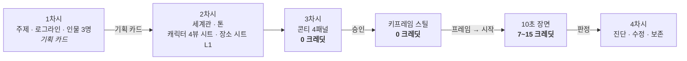

# 한국어 숏폼 드라마 스킬 — Google Flow 4단계

**세로 9:16 한국어 숏폼 드라마**를 AI와 대화하며 만드는 4단계 스킬입니다.
대상: Gemini Spark / Google Flow 사용자 (강의·개인 실습용)


> **스킬이 하는 일은 프롬프트를 내어주는 것입니다.** Flow 화면 조작은 사람이 직접 합니다.
> 클릭·입력·생성을 대신하지 않습니다.

---

## 왜 필요한가

AI 영상 도구로 드라마를 만들면 세 곳에서 깨집니다.

| 깨지는 곳 | 왜 | 이 스킬의 해법 |
|---|---|---|
| **옷·얼굴이 컷마다 바뀐다** | 상반신 정면 1장에는 등·소매·신발 정보가 없다 → 모델이 지어낸다 | **4뷰 시트**(정면·3/4·측면·후면 + 얼굴) · 2벌은 **편집 파생** |
| **배경·행동이 상상과 다르다** | 문장만으로 지시한다 | **콘티 4패널로 먼저 승인**(0크레딧) → **키프레임 → `프레임 → 시작`** |
| **화면 속 한글이 깨진다** | 한글은 자모 조합이라 렌더링이 무너진다 | 화면 글자는 **전부 후반 합성**, 프롬프트에 금지 문구 고정 |

## 파이프라인



> 콘티에서 승인받고 → 키프레임을 `프레임 → 시작` 에 넣고 → 그 다음에 영상 크레딧을 쓴다.

**이미지 단계(시트·장소·콘티·키프레임)는 전부 0크레딧입니다.** 돈은 영상 `생성 시작`에서 처음 나갑니다.

## 4단계

| 단계 | 스킬 | AI와 함께 정하는 것 | 내어주는 프롬프트 | 비용 | 참조 문서 |
|---|---|---|---|---|---|
| 1 | [drama-story](skills/drama-story) | 주제·로그라인·인물 3명·3비트 | 기획 카드 · 외형 스케치 | `0` | 7 |
| 2 | [drama-world](skills/drama-world) | 세계관·톤 + **캐릭터 4뷰 시트**·장소 시트 | 시트 프롬프트 · 장소 접미어 | `0` | 8 |
| 3 | [drama-shots](skills/drama-shots) | **콘티 4패널 승인 → 키프레임 →** 10초 장면 | 콘티 · 키프레임 · 장면 | `0` → 영상 `7~15` | 12 |
| 4 | [drama-cut](skills/drama-cut) | 진단 · 수정 · 보존 | 수정 프롬프트 · 판정표 | `7~15` | 9 |

각 스킬은 단독으로도, 앞 단계의 **기획 카드**(`assets/project-card.json`)를 이어받아서도 쓸 수 있습니다.

## 저장소 구조

```
skills/                     ← 스킬 본체 (Spark 업로드용 zip은 dist/)
  drama-story/  SKILL.md + references/(7) + assets/(7)
  drama-world/  SKILL.md + references/(8) + assets/(7)
  drama-shots/  SKILL.md + references/(12) + assets/(7)
  drama-cut/    SKILL.md + references/(9) + assets/(7)
dist/                       ← Spark 업로드용 zip 4종
examples/ep01/              ← 실제 완주 기록 (기획 → 시트 → 콘티 → 키프레임 → 장면)
scripts/                    ← check_prompt.py (프롬프트 검수기) · selftest.py (구조 점검)
docs/                       ← 강의용 설치 안내
DESIGN.md  CHANGELOG.md  AGENTS.md  CONTRIBUTING.md  LICENSE.md
```

**`references/`** 는 주제별 규칙 문서입니다 — 프롬프트 해부 · 샷 문법 · 조명 · 캐릭터 일관성 · 콘티/키프레임 · 한국어 대사 · 수정 · 실패 사전 · 비용.
**`assets/`** 는 채워 넣는 양식 7종입니다 — 기획 카드 · 캐릭터 시트 · 장소 시트 · 콘티 패널 · 샷 · 렌더 로그 · 판정.

## 예제 — 실제로 만든 것

[`examples/ep01/`](examples/ep01) — 「셔터」: 40년 웃기만 하던 국숫집 노인이 갑질 손님에게 문을 닫고 컨버터블을 타고 떠난다.

| 단계 | 크레딧 | 상태 |
|---|---|---|
| 캐릭터 4뷰 시트 3명 (+정장 파생) | **0** | ✅ 승인 |
| 장소 시트 · 콘티 4패널 · 키프레임 | **0** | ✅ 승인 |
| 10초 장면 (Omni 1.1 Flash 360p) | 7 | ⬜ 대기 |

AI에게 이렇게 말하면 이어서 시작합니다.

```
examples/ep01/00-project-card.json 을 읽고, 내 이야기로 바꿔서 1차시부터 같이 하자.
```

## 실측 근거 (2026-09-30 · 유료 PRO 계정 · 크레딧 0 소모)

| 모델 | 옵션 | 크레딧 |
|---|---|---|
| 이미지 모드 (Nano Banana Pro / 2 / 2 Lite) | 비율 5종 · x1~x4 | **0** (승인 창 없음) |
| Omni 1.1 Flash | 10초 | 360p **7** · 720p **15** |
| Omni 1.1 Flash | 8초 / 6초 / 4초 | 360p 6/5/4 · 720p 12/10/7 |
| Veo 3.1 - Lite | 해상도·길이 선택 없음 | x1 **10** · x2 **20** · x4 **40** |

- **비율 선택이 반영되지 않습니다** (16:9를 눌러도 9:16 생성) → 프롬프트에 `9:16` 을 직접 씁니다.
- 단가가 아니라 **"승인된 클립당 비용"** 으로 봅니다. 저렴해도 재생성이 많으면 비쌉니다.

## 설치 (Gemini Spark)

1. [Gemini Spark의 Skills 화면](https://support.google.com/gemini/answer/17094296?hl=ko)을 엽니다.
2. `dist/` 에서 스킬 zip을 받습니다. GitHub에서는 **Download raw file** 을 고릅니다.
   zip 최상위에 `SKILL.md`, 그 아래 `references/`(규칙 문서·그림)와 `assets/`(양식)가 들어 있습니다.
3. Spark에서 **업로드** → zip 지정 → 내용 확인 → 생성. 네 개를 다 쓰면 각각 올립니다.
4. 새 작업에서 `/` 로 스킬을 고르거나 관련 작업을 요청해 자동 적용합니다.
   첫 입력 예: `2분짜리 가족 드라마를 기획하고 싶어. 9:16, 한국어 대사야.`

Spark 스킬은 만 18세 이상 개인 Google 계정과 활동 기록 설정이 필요합니다. 요금제·지역 요건은 [Google 공식 안내](https://support.google.com/gemini/answer/17094296?hl=ko)를 확인하세요.

## 개발 · 갱신

```bash
python3 build.py --no-install      # 스킬 4종 조립 (SKILL.md + references + assets)
python3 build.py                   # 조립 + ~/.hermes/skills/creative/ 에 설치
python3 _shared/scripts/selftest.py        # 구조 점검 (frontmatter·깨진 링크·양식)
python3 _shared/scripts/check_prompt.py prompts/   # 프롬프트 검수 (규칙 준수)
python3 tools/export_repo.py       # 저장소 동기화 (조립 → zip → commit)
```

## 스킬이 하는 일 / 하지 않는 일

| 합니다 | 하지 않습니다 |
|---|---|
| 대화로 재료를 받아 **프롬프트 전문**을 만들어 줍니다 | **Flow 화면을 조작하지 않습니다** (클릭·입력·생성 대행) |
| **붙일 위치**와 **판정 기준**을 함께 알려 줍니다 | 계정 등급·UI 상태를 검증하거나 추정하지 않습니다 |
| 결과를 듣고 **원인을 진단**해 다음 프롬프트를 고칩니다 | `생성 시작`·`승인`을 대신 누르지 않습니다 |

## 프롬프트 원칙 (요약)

- 지시문은 **영어**, **대사만 한국어**. 대사는 프롬프트 **맨 앞**에 한 문장만.
- 화면 속 한글은 **전부 후반 합성** → `No text overlay on screen.`
- 대사 샷은 **단일 샷으로 잠급니다** (`In a single unbroken scene, no scene cuts.`)
- 길이 **10초**, 비율 **9:16** 을 항상 명시합니다.
- 수정은 **4턴 안에**. 더 필요하면 새로 만듭니다.
- 프롬프트 파일에 **모델 · 해상도 · 길이 · 크레딧 · 판정**을 함께 기록합니다.

## 검증 상태

| 검증됨 (2026-09-29/30 실측) | 미검증 |
|---|---|
| 이미지 0크레딧 · 시트 4뷰 · 편집 파생 · 콘티 4패널 · 장소 시트 · 비율 무시 · 한국어 대사 ASR | 콘티에 참조 3장 동시 첨부 · `프레임 → 시작` 이 구도·의상을 따라오는지 · 시트 그림의 캐릭터 등록 · Spark 업로드 용량 한도 · Veo 3.1 Fast/Quality 단가 |

## 사용 조건

[LICENSE.md](LICENSE.md) 를 확인하세요. (강의 수강생에게 강의·개인 실습 목적의 사용을 허여)
