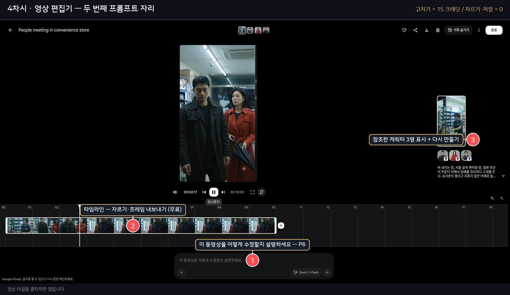
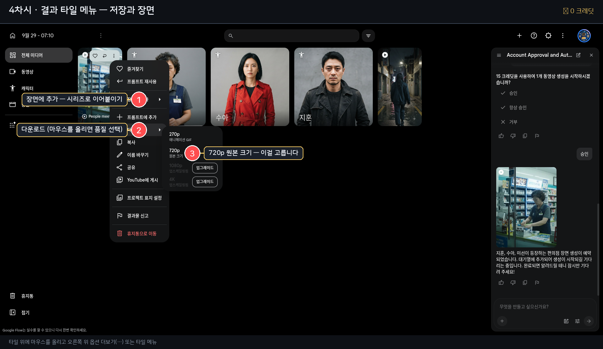

# 4차시 · 검수 — AI와 함께 보고, 고치고, 남긴다

> 결과를 **AI에게 말로 설명하면 AI가 원인을 진단하고 수정 프롬프트를 써 준다.**
> 그리고 **모델이 못 하는 것을 가려내 후반 작업으로 넘긴다.**
>
> 🔴 **스킬의 산출물은 프롬프트 텍스트다.** Flow 화면을 조작하지 않는다 (클릭·입력·생성 대행 없음).
> 내어주는 것 3가지: **수정 프롬프트 전문 + 붙일 위치 + 판정 기준.** 붙이고 누르는 것은 사람이 한다.

`💰💰 수정도 영상과 같은 단가다` — **생성 전에 프롬프트바의 `생성 시 N크레딧` 을 읽는다.**
(참고치: 10초 기준 360p **7** / 720p **15**) **다운로드·저장은 무료다.**

**AI가 반드시 읽을 것**: `references/editing-and-revision.md` (**§1 4턴 규칙, §3 자주 쓰는 편집, §5 판정**) + `references/failure-atlas.md` (**§1~4 단계별 처방, §5 진단 순서**) + `references/drama-craft.md` (§6 검수·고난도 표기)

---

## ① 이 차시가 끝나면

**고친 영상 1편 + 컴퓨터에 저장된 파일 1개.** 그리고 다시 만들지 않고 고칠 수 있는 판단력.



---

## ② 먼저 확인 — AI에게 물어보기 전에 눈으로 본다

**다섯 가지만 본다.**

| # | 볼 것 | 정상 |
|---|---|---|
| 1 | **사람** | 3명 얼굴이 2차시와 같은가 |
| 2 | **장소** | 프롬프트에 쓴 곳인가 |
| 3 | **동작** | 대사가 나왔을 때 입이 움직였는가 |
| 4 | **소리** | 대사가 실제로 들리는가 |
| 5 | **글자** | 화면에 깨진 한글이 있는가 |

> **4번은 반드시 소리를 켜고 확인한다.** 화면만 보면 대사가 안 나온 걸 놓친다.

---

## ③ AI에게 이렇게 말한다

영상 자체를 AI에게 보여줄 수 없으니 **글로 설명한다.** AI는 그걸로 진단한다.

```
이렇게 말하면 된다 (예):

"편의점 안에서 3명이 나오는 장면인데, 두 번째 여자가
 '여기서 뭐 하는 거예요?'라고 말하는 부분에서 입이 안 움직였어.
 그리고 끝에 남자가 고개를 돌리는 게 너무 빨라.
 배경은 잘 나왔어."
```

**AI가 물어볼 것** — 하나씩:

| # | 질문 | 가려내는 것 |
|---|---|---|
| 1 | **"무엇이 마음에 안 드나요?"** — 얼굴 / 장소 / 동작 / 소리 / 길이 / 처음과 끝 | 문제 분류 |
| 2 | **"어느 초쯤인가요?"** | 고칠 위치 |
| 3 | **"그 부분이 원래 어떻게 되길 원했나요?"** | 목표 |

---

## ④ AI가 판단하는 것 — **고칠 수 있는가, 없는가**

**여기가 이 차시에서 가장 값진 부분이다.**
초보자는 모델이 못 하는 것을 계속 시도하다 크레딧을 태운다. **AI가 먼저 말해 줘야 한다.**

| 안 되는 것 | 대신 |
|---|---|
| 화면 안의 정확한 한글 (간판·서류·휴대폰) | **후반 합성** (편집 단계) |
| 3명이 동시에 다른 동작 | **한 명씩 순서대로** 움직이게 하고 컷으로 잇기 |
| 빠른 카메라 회전 + 고정 카메라 동시 | 하나만 |
| 그림자 분리·연속 동작 | 여러 샷으로 나눠 편집으로 속도감 |
| **편집 4턴 초과** | **새로 생성**한다 (5턴부터 모션 저하·얼굴 드리프트) |

> **AI는 "이건 모델이 못 합니다"라고 솔직히 말한다.** 대신 할 수 있는 방법을 제안한다.
> **대신 결정하지는 않는다** — 고칠지 / 넘길지 / 새로 만들지는 **사용자가 고른다.**

---

## ⑤ AI가 써 주는 것 — **P6 수정 프롬프트**

**규칙 3개**: ① 한 번에 변수 하나 ② 항상 `나머지는 그대로 유지해` ③ 4턴 넘기지 않기

| | |
|---|---|
| ✅ | `여자가 말할 때 입이 움직이게 해줘. 나머지는 그대로 유지해.` |
| ❌ | `편의점 안에서 여자가 말하는 장면에서 입모양이 안 맞으니까 입이 움직이도록 고쳐주고...` |

**짧고 외과적으로.** 길면 diff 엔진이 헷갈린다(구글 공식).

**자주 쓰는 수정 4종**

```
① 입모양:     "대사할 때 입이 움직이게 해줘. 나머지는 그대로 유지해."
② 동작 속도:  "마지막 고개 돌리는 동작을 더 천천히 해줘. 나머지는 그대로 유지해."
③ 색·소품:    "코트 색만 남색으로 바꿔줘. 나머지는 그대로 유지해."
④ 배제 추가:  "화면에 글자가 나오지 않게 해줘. 나머지는 그대로 유지해."
```

---

## ⑥ 저장 — **무료이고, 여기서 대부분이 실수한다**



```
타일 위 메뉴(⋮) → 다운로드 → 720p 원본 크기
```

| 선택 | 결과 |
|---|---|
| **720p 원본 크기** | ✅ 이걸 고른다 — 720×1280, 소리 있음 |
| 270p GIF | ❌ 소리 없음. 미리보기용 |
| 프롬프트 재사용 | 복사용 (만든 프롬프트가 필요할 때) |
| 이름 바꾸기 | 나중에 찾기 쉽게 |
| YouTube에 게시 | 선택 |

> **실측**: 720p 다운로드 결과 = **720×1280 (9:16), 정확히 10.000초, 24fps, 3.8MB, 소리 정상**
> **다운로드·저장은 크레딧이 들지 않는다.** 마음껏 받는다.
> **안 받고 지나가면 나중에 다시 만들 때 같은 크레딧이 또 나간다.**

---

## ⑦ 시리즈로 이어가기

한 편으로 끝내지 않으려면 **세계관 스타일 1줄과 캐릭터 3명을 그대로 재사용한다.**

```
2차시에서 만든 캐릭터 3명  →  그대로 쓴다 (다시 만들지 않는다)
③에서 정한 스타일 전역 1줄 →  P5에 그대로 붙인다
1차시 기획 카드의 다음 3비트 → 새 장면으로
```

**캐릭터를 다시 만들면 다른 사람이 된다.** 반드시 **같은 캐릭터를 `@` 로** 다시 붙인다.

---

## ⑧ 막히면

| 증상 | 처방 |
|---|---|
| 대사를 넣었는데 입이 안 움직인다 | P6으로 고친다. **대사 샷에 `장면 전환 없음`이 있었는지 먼저 확인** |
| 고쳐도 계속 이상하다 | **편집 4턴을 넘겼다.** 새로 생성한다 — 크레딧을 두 번 쓰지 않는다 |
| 소리가 안 나온다 | **실측상 소리는 정상이다.** 270p GIF로 받은 게 아닌지 확인한다 |
| 화면에 깨진 한글이 있다 | **모델 한계다.** 프롬프트로 고칠 수 없다 → 후반 합성 |
| 얼굴이 2차시와 다르다 | P2의 `금지변화`를 보강하고 **다시 만들어야 한다.** 이번 편은 못 고친다 |
| 새로 만들어야 할까 고민된다 | **3회 시도해도 방향이 틀렸으면 이야기 문제다. 1차시로 돌아간다** |

---

## ⑨ 확인 카드

- [ ] 소리를 켜고 **대사를 확인**했는가
- [ ] **720p 원본**으로 다운로드했는가 (270p GIF 아님)
- [ ] 파일이 컴퓨터에 **저장됐는가** (다운로드 폴더)
- [ ] 고친 게 있다면 **`나머지는 그대로 유지해`** 를 붙였는가
- [ ] 편집 **4턴을 넘기지 않았는가**
- [ ] 다음 편을 만들 때 **같은 캐릭터 3명**을 쓸 준비가 됐는가

---

## ⑩ 전체 4차시 완주

```
1차시  AI와 주제 정하기        💰0
2차시  AI와 세계관 정하기 → 캐릭터 3명   💰0
3차시  AI가 쓴 장면 프롬프트로 10초 영상  💰15
4차시  AI와 진단 → 수정 → 저장           💰15
                                    ───────
                                    합계 30 크레딧
```

**핵심은 이겁니다** — 사용자는 **판단만** 하고, **프롬프트는 AI가 씁니다.**

## 참조 파일

- `references/prompt-recipes.md` — **색인**
- `references/editing-and-revision.md` — **4턴 규칙 · 좋은/나쁜 편집 지시 · 판정 항목**
- `references/failure-atlas.md` — **증상 → 원인 → 처방** (단계별) + 진단 순서
- `references/korean-dialogue.md` — 대사가 안 들릴 때의 폴백
- `references/character-consistency.md` — 얼굴·옷이 바뀌었을 때
- `references/prompt-anatomy.md` — 5부 구조·금지 세트
- `references/drama-craft.md` — §6 검수 라운드·고난도 표기
- `references/flow-paste.md` — 타일 메뉴·다운로드 (부록)
- `references/cost-and-safety.md` — 비용 경계
- `assets/` — 판정·렌더 로그 양식
- `references/figures/` — 편집기·타일 메뉴
