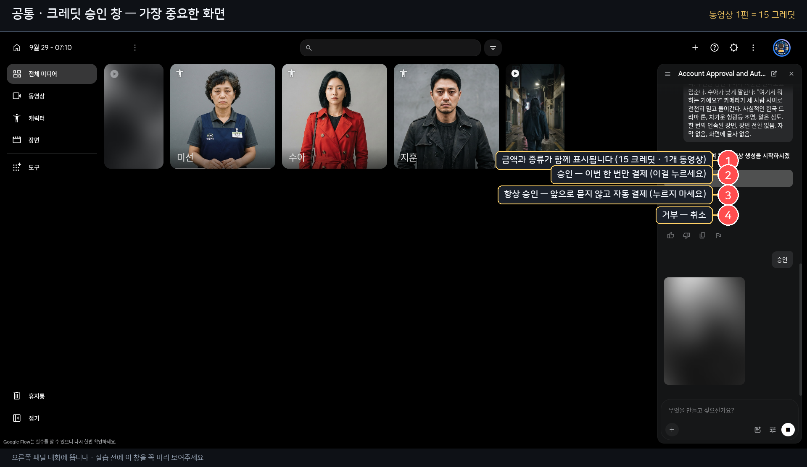

# Flow에 붙여넣기 — 딱 이것만 (사람용 부록)

> **이 스킬의 중심은 여기가 아니다.** Flow는 사람이 판단해서 쓰는 도구다.
> 이 문서는 "AI가 써 준 프롬프트를 **어디에 넣는지**"만 확인하는 부록이다.
> 실물 화면 실측 기준 (2026-09-29 ~ 09-30).
>
> ⚠️ **여기 적힌 클릭은 전부 사람 손이다.** AI에게 "Flow에 넣어줘"라고 시키는 문서가 아니다.
> 스킬은 **프롬프트를 만들고 · 위치를 알려주고 · 결과를 판정**한다. 그 이상은 하지 않는다.

---

## 1. 여덟 곳

| AI가 준 프롬프트 | 어디에 넣나 | 비용 |
|---|---|---|
| **P2 외형 → 캐릭터 시트** | 📝 프로젝트 프롬프트 상자 (**이미지 모드**) | **0** |
| **P3 성격** | 🎬 캐릭터 상세 → **`캐릭터 정보`** (캐릭터를 등록한 경우) | **0** |
| P4 고치기·환복 | 이미지를 열었을 때 → **`어떤 내용을 변경하시나요?`** | **0** |
| **P7 콘티 4패널** | 📝 프로젝트 상자 (이미지 모드 · 캐릭터 시트 `@`) | **0** |
| **P8 키프레임 스틸** | 📝 프로젝트 상자 (이미지 모드 · 단일 프레임) | **0** |
| **P5 장면** | 📝 프로젝트 상자 (동영상 모드 · `프레임 → 시작` 에 키프레임) | **7~15** |
| **P6 수정** | ✏️ 만든 영상을 열었을 때 **아래쪽 상자** | **7~15** |
| P1 기획 | **넣지 않는다** — 종이/메모장에 둔다 | 0 |

**기억법**: **이미지 단계는 전부 무료, 영상부터 유료.**

---

## 2. 소재(참조) 붙이기 — 실측 절차

```
프롬프트 상자 클릭 → `@` 입력 → 피커 열림
   ↓ 왼쪽에서 `이미지` 탭 클릭     ← 기본이 `장면`이면 `애셋이 없습니다` 로 비어 보인다
   ↓ 목록에서 항목 클릭
   ↓ 오른쪽 아래 `프롬프트에 추가`
   ↓ (한 명씩 반복 — 다중 선택은 안 된다)
```

⚠️ **썸네일이 깨져 보일 때가 있다 → 제목으로 구분한다.**
제목도 잘려서 나오기 때문에(예: `Woman character turnaround refer…`) **두 캐릭터가 같은 이름으로 보인다.**
→ 그래서 **미리 이름을 붙여 둔다** (`미영 시트` / `만복 시트` / `순자 시트`).

---

## 3. 시작 프레임(키프레임) 붙이기 — 실측

```
프롬프트바의 `동영상 · …` 칩(=설정 트리거) 클릭 → `동영상`
   ↓ `프레임` 클릭
   ↓ `시작` 슬롯 클릭 → 피커 `이미지` 탭 → 키프레임 스틸 선택
※ `종료` 슬롯도 있다 (가운데 `swap_horiz` 로 서로 바꾼다)
```

**모드별로 고를 수 있는 것이 다르다**

| 모드 | 고를 수 있는 것 |
|---|---|
| **이미지** | 비율 5종(16:9·4:3·1:1·3:4·**9:16**) · 모델 3종 · 개수 x1~x4 |
| **동영상 · Omni 1.1 Flash** | 비율(16:9·9:16) · 모델 · **360p/720p** · **4·6·8·10초** · 개수 x1~x4 |
| **동영상 · Veo 3.1 - Lite** | 비율 · 모델 · 개수 (해상도·길이 선택 없음) |

> 모델을 바꾸면 아래 항목이 **바뀐다.** 패널을 열어 **무엇이 있는지 확인**하고 고른다.

---

## 4. 순서 (v3)

```
[2차시 · 0크레딧]
⚙ 설정 → 이미지 → 🍌 Nano Banana 2 Lite → 9:16 → x1
   ↓ 캐릭터 시트 프롬프트 → 생성 시작 (승인 창 없음)
   ↓ ★ 이름 붙이기  → 3명 반복 (2벌은 편집 파생)
   ↓ 로케이션 시트도 같은 방식

[3차시 · 0크레딧]
   ↓ 콘티 프롬프트 + @캐릭터 시트 → 4패널 → 사람이 승인
   ↓ 승인된 첫 패널 → 키프레임 스틸 1장

[3차시 · 유료]
   ↓ ⚙ 설정 → 동영상 → Omni 1.1 Flash → 9:16 → 360p → 10초 → x1
   ↓ 프레임 → 시작 → 키프레임 붙이기
   ↓ @ 로 캐릭터 시트·장소 시트 붙이기
   ↓ P5 붙여넣기 → 프롬프트바의 `생성 시 N크레딧` 확인
   ↓ 생성 시작 → 승인 창 → `승인`  (⚠️ `항상 승인` 아님)
```

---

## 5. 붙일 때 주의 4가지

| | |
|---|---|
| **캐릭터는 `@` 로 붙인다** | 프롬프트에 이름을 써 두는 것만으로는 부족하다 |
| **한 번에 하나씩** | `@` → 클릭 → `프롬프트에 추가` 를 반복 |
| **비율은 설정에서** | 숏폼은 **9:16**. 상자에는 비율 선택이 없다 |
| **이름을 붙여 둔다** | 썸네일이 깨지면 **제목이 유일한 단서**다 |

---

## 6. 비용 경계 (v3)

| 구간 | 비용 |
|---|---|
| 1차시 (AI와 대화) | **0** |
| 2차시 (캐릭터 시트 · 로케이션 시트) | **0** |
| 3차시 **콘티 · 키프레임** | **0** |
| 3차시 영상 (10초) | 360p **7** / 720p **15** |
| 4차시 수정 1회 | 영상과 같음 |

**돈은 3차시 `생성 시작`에서 처음 나간다.** 그 전까지는 몇 번을 다시 해도 무료다.
→ **콘티와 키프레임에서 최대한 고민하는 것이 곧 돈을 아끼는 것이다.**

---

## 7. 🔴 승인 창



`승인`만 누른다. **`항상 승인`은 앞으로 묻지 않고 자동으로 차감한다.**
