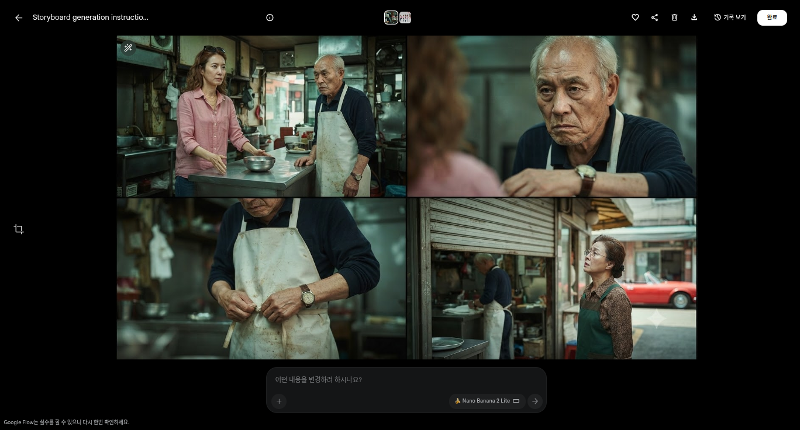
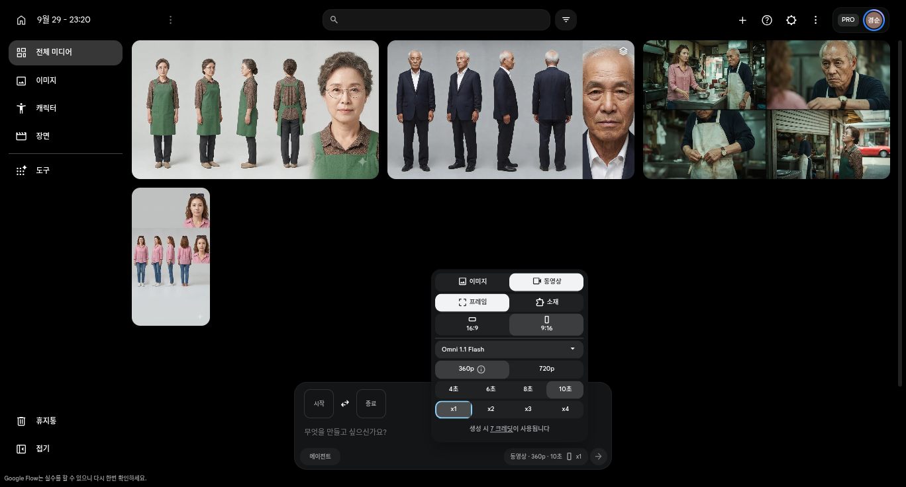

# 3차시 · 장면 — **콘티로 승인받고, 키프레임으로 연기시킨다**

> 1·2차시에서 정한 것을 **AI가 콘티(4패널 그림)와 장면 프롬프트로 조립해 준다.**
> 사용자는 **콘티를 보고 승인**하고, 승인된 그림을 **시작 프레임**으로 넣고 `생성 시작`만 누른다.
>
> 🔴 **스킬의 산출물은 프롬프트 텍스트다.** Flow 화면을 조작하지 않는다 (클릭·입력·생성 대행 없음).
> 내어주는 것 3가지: **프롬프트 전문 + 붙일 위치 + 판정 기준.** 붙이고 누르는 것은 사람이 한다.

`💰 이미지 단계는 0크레딧` · `💰💰 영상에서 처음 돈이 나간다`

**AI가 반드시 읽을 것**: `references/conti-and-keyframe.md` (**§2 콘티 규칙, §4 키프레임, §5 시작 프레임 장면**) + `references/prompt-anatomy.md` (5부 공식·타임코드·샷 잠금·금지 세트) + `references/shot-grammar.md` (샷 크기·무빙·비트) + `references/korean-dialogue.md` (대사 문형·억양)

---

## ① 이 차시가 끝나면

**10초 영상 1편.** 그런데 **영상 크레딧을 쓰기 전에** 두 번의 무료 관문을 지난다.

```
콘티(4패널)  →  키프레임 스틸  →  영상
   0크레딧        0크레딧        7~15크레딧
   배경·행동 확정   구도 확정      여기서만 돈
```

**왜 이 순서인가**: 문장으로만 장면을 지시하면 **배경과 행동이 매번 달라진다** (현장 관찰).
그림으로 먼저 확정해 두면 **실패를 영상 크레딧을 쓰기 전에** 걸러낼 수 있다.

---

## ② AI와 대화로 장면 설계하기

**1차시 기획 카드의 3비트를 꺼낸다.** 그걸 10초 안에 실제로 배치하는 것이 이 차시다.

AI가 물어볼 것 — **하나씩.**

| # | 질문 | 정해지는 것 |
|---|---|---|
| 1 | **"10초 중에 가장 중요한 한 순간은 언제인가요?"** | **반전 비트** (보통 3-6초) |
| 2 | **"그 순간에 누가 무엇을 하나요?"** | 동작 |
| 3 | **"대사가 있나요? 있다면 한 마디만 골라 주세요."** | 대사 |
| 4 | **"마지막 2초는 무엇으로 끝나나요?** — 표정 / 시선 / 문 닫힘 / 정지" | 여운 |
| 5 | **"카메라가 움직이나요, 고정인가요?"** | 샷 구성 |

**질문 1번이 핵심이다.** 가장 중요한 순간을 3-6초에 놓고, 앞뒤를 거기 맞춰 채운다.

> **대사는 한 마디만.** 10초에 두 마디는 안 들어간다. 여러 마디가 필요하면 10초가 아니라 20초다.

---

## ③ 콘티를 먼저 만든다 — **4패널 승인용 그림** (0크레딧)

장면을 글로만 지시하지 않는다. **먼저 그림 4칸으로 만들어 사람이 본다.**

| 항목 | 값 |
|---|---|
| 만드는 곳 | 프로젝트 화면 프롬프트 상자 · **이미지 모드** (`🍌 Nano Banana 2 Lite`) |
| 참조 | **캐릭터 시트 3장을 `@` 로 붙인다** (②에서 만든 것) |
| 결과 | **정확히 4패널 · 2x2 콘택트시트** (10초 3비트 + 여운 컷) |
| 비용 | **0크레딧 · 승인 창 없음** |



**콘티 프롬프트 규칙** (`references/conti-and-keyframe.md` §2)
1. 첫 줄에 **`GENERATE THE STORYBOARD IMAGE NOW.`** — 설명·계획을 쓰지 못하게 막는다
2. **패널 수와 배열을 명시**한다 (`exactly 4 panels in one 2x2 storyboard contact sheet`)
3. **패널마다 행동을 하나씩** 지시한다 (P1…P4)
4. **화면 글자 금지**를 강하게 쓴다 (라벨·자막·숫자 전부)
5. **참조를 붙여 패널 간 인물을 고정**한다

**콘티에서 확인할 것** (사람이 승인)

- [ ] 패널 수·배열이 맞는가
- [ ] 인물이 패널마다 같은 사람인가 (옷·머리·소품)
- [ ] 배경이 같은 장소로 보이는가
- [ ] **단서 소품**이 들어갔는가 (이 이야기에서는 **빨간 컨버터블**)
- [ ] 화면에 글자가 없는가

> 콘티는 **승인 전용**이다. 마음에 안 들면 **다시 뽑는다 — 0크레딧**이다.
> 프롬프트에서 고칠 것이 있으면 **한 가지만** 바꿔 다시 뽑는다.

---

## ④ 키프레임 스틸 1장 — **시작 프레임이 될 그림** (0크레딧)

**콘택트시트는 영상 입력으로 쓸 수 없다**(칸이 여러 개다). 영상은 **이미지 1장**을 받는다.

→ 승인된 **첫 패널(0초 상태)** 을 **단일 스틸 1장**으로 다시 뽑는다. 역시 이미지 모드 · 0크레딧.
→ 이 스틸을 **시작 프레임**으로 넣으면 **첫 구도·배경·의상이 영상까지 그대로 따라온다.**

템플릿은 `references/conti-and-keyframe.md` §4. (콘티 프롬프트에서 `4패널` 문장만 빼고 `Single cinematic still frame`으로 바꾼 형태)

---

## ⑤ AI가 써 주는 것 — **P5 장면 프롬프트**

**5부 공식 순서로 조립한다** (순서가 곧 가중치): ① 샷 ② 스타일 ③ 조명 ④ 장소 ⑤ 동작·대사

**시작 프레임을 붙였을 때는 한 줄을 더 넣는다** — `Animate from the provided first frame.`
(첫 프레임이 이미 구도를 정했으므로, 프롬프트는 **그림에서 무엇이 움직이는가**를 쓴다)

### 실제로 검증된 예시 (2026-09-29, 한국어 대사 발음 확인됨)

```
얕은 심도의 미디엄 샷, 한 번의 연속된 장면, 장면 전환 없음.
사실적인 한국 드라마 톤, 정오의 하얀 직사광, 강한 콘트라스트.
재래시장 한가운데 국숫집 앞, 낡은 철제 셔터와 스테인리스 카운터.
[0-3초] 분홍색 린넨 셔츠의 40대 여성 미영이 빈 그릇을 카운터에 쿵 밀어놓으며 비웃듯 말한다:
        "다 먹었는데 맛이 없네요, 이 나이 먹고 장사 그렇게 하세요?"
        흰 앞치마의 노인 만복의 웃음이 멈춘다.
[3-6초] 만복이 아무 말 없이 앞치마 끈을 풀어 카운터에 내려놓는다. 왼손목의 낡은 가죽줄 금속 시계가 드러난다.
[6-10초] 만복이 셔터 줄을 당긴다. 셔터가 내려온다. 옆 가게 순자가 놀라 고개를 든다.
대사 없음(위 한 문장 제외), 내레이션 없음.
자막 없음, 화면에 글자 없음, 워터마크 없음.
같은 인물, 옷 색 유지, 머리 모양 유지, 얼굴 유지.
```

**이 줄들이 규칙대로 다 들어가 있다** — 확인해 보자.

| 규칙 | 어디에 |
|---|---|
| 샷 잠금 | `한 번의 연속된 장면, 장면 전환 없음.` ← **대사 샷이므로 필수** |
| 스타일 전역 | `사실적인 한국 드라마 톤, 정오의 하얀 직사광.` |
| 장소 접미어 | `재래시장 한가운데 국숫집 앞 …` (`world` ⑤-b) |
| 타임코드 3비트 | `[0-3초] [3-6초] [6-10초]` |
| 한국어 대사 | `비웃듯 말한다: "…"` ← **그대로 발음됐다** |
| 배제 | `자막 없음, 화면에 글자 없음.` |
| 금지 세트 | `같은 인물, 옷 색 유지, …` |

**AI는 이 줄들을 매번 자동으로 넣는다.** 사용자가 기억할 필요가 없다.

---

## ⑥ Flow에서 **사람이** 할 일 (순서 그대로)

> 스킬의 몫은 여기까지다. **아래 클릭은 사람이 직접 한다.**

```
1. 콘티 4패널 생성   (이미지 모드 · 캐릭터 시트 @)          [0]
2. 콘티 승인 (사람이 눈으로)                                 [0]
3. 첫 패널 → 키프레임 스틸 1장                               [0]
4. ⚙ 설정 → 동영상 → Omni 1.1 Flash → 9:16
        → 화면이 작으면 360p / 뽑을 땐 720p
        → 길이 10초 → 개수 x1
5. 프레임 → `시작` → 3번 스틸 붙이기                         [0]
6. @ 로 캐릭터 시트·장소 시트 붙이기                          [0]
7. P5 붙여넣기 → 프롬프트바의 `생성 시 N크레딧` 확인 → 생성 시작
8. 승인 창 → `승인`  (⚠️ `항상 승인` 아님)
9. 결과 확인 → 마음에 들면 **같은 프롬프트로 720p 확정본**
```



> **시작 프레임 붙이는 곳**: 설정 트리거 클릭 → `동영상` → **`프레임`** → **`시작`** 슬롯 클릭 → 피커에서 `이미지` 탭 → 스틸 선택.
> (`종료` 슬롯도 있고 `swap_horiz` 로 서로 바꾼다. 세부는 `references/flow-paste.md`)

**해상도는 스킬이 정하지 않는다.** 사람이 빠르게 확인할 땐 **낮게**, 확정할 땐 **높게** 고른다.

---

## ⑦ 비용 — 숫자는 **참고치**, 실제는 **화면에서 읽는다**

프롬프트바는 **생성 전에 실시간으로** 단가를 표시한다: `생성 시 N크레딧이 사용됩니다`.
**승인 창보다 먼저 뜬다.** 그래서 **생성 버튼을 누르기 전에** 비용을 알 수 있다.

| 모델 | 360p | 720p |
|---|---|---|
| Omni 1.1 Flash 4초 | 4 | 7 |
| Omni 1.1 Flash 6초 | 5 | 10 |
| Omni 1.1 Flash 8초 | 6 | 12 |
| **Omni 1.1 Flash 10초** | **7** | **15** |
| Veo 3.1 - Lite | 해상도·길이 선택 없음 (x1 = 10) | 〃 |

- **개수(x2·x4)는 배수**로 붙는다 (720p 10초 x2 = 30)
- 모델마다 **옵션이 다르다** → 무엇을 고를 수 있는지는 **패널을 열어 확인**한다
- 자세한 표: `references/cost-and-safety.md`

**→ 강의 실습은 360p(7)로 확인하고, 확정본만 720p(15).** 같은 내용을 두 번 만들면 7+15=22다.

### 🔴 승인 창 — 수업 전에 미리 보여준다


`승인`만 누른다. **`항상 승인`은 앞으로 묻지 않고 자동으로 차감한다.**
수업 중 처음 보게 하지 말고, **오프닝에서 이 그림으로 먼저 경고한다.**

---

## ⑧ 생성은 몇 분 걸린다

`생성 시작`을 누르면 **결과가 바로 나오지 않는다.** 몇 분 기다린다.

- **같은 버튼을 다시 누르지 않는다** ← 두 번 눌러서 크레딧을 두 배로 쓰는 실수가 가장 많다
- 기다리는 동안 다른 탭을 열어도 된다

---

## ⑨ 막히면

| 증상 | 진짜 원인 | 처방 |
|---|---|---|
| **배경·행동이 상상과 다르다** | 문장만으로 지시했다 | **콘티를 먼저 그린다** (③) — 그림이면 오해가 없다 |
| 인물이 패널마다·컷마다 다르다 | 참조를 안 붙였다 | **캐릭터 시트를 `@` 로** 붙인다 |
| 옷이 컷마다 달라진다 | 시트에 뒷모습·소매가 없다 | 시트를 다시 (0크레딧, `drama-world` ④) |
| 첫 컷 구도가 계속 달라진다 | 시작 프레임 없음 | `프레임 → 시작` 에 키프레임을 붙인다 |
| 장면이 2~3번 바뀐다 | **샷 잠금 문구 누락** | `한 번의 연속된 장면, 장면 전환 없음.` |
| 화면에 글자가 깨진다 | 배제 문구 누락 | `자막 없음, 화면에 글자 없음.` |
| 성격을 넣었는데 표정이 그대로 | **설명칸에 썼다** | 성격은 `캐릭터 정보`(P3)로 옮긴다 |
| 2편째 얼굴이 달라진다 | `금지변화` 누락 | 시트/P2에 `금지변화` 줄 추가 |
| 갈등이 안 보인다 | **일상으로 시작** | 1차시 개막 공식으로 돌아간다 |
| 10초가 늘어진다 | 비트가 2개 이하 | 3비트 타임코드로 다시 |
| 10초에 아무것도 안 남는다 | 비트가 4개 이상 | 하나를 빼고 그 하나를 길게 |
| 대사가 안 들린다 | 대사 2개 이상 / 로마자 | **한 문장, 한국어 그대로** |
| 3회 연속 방향이 틀렸다 | **프롬프트 문제가 아니다** | **1~2차시로 돌아간다.** 프롬프트를 더 만지지 않는다 |

---

## ⑩ 확인 카드

- [ ] **콘티 4패널**을 만들어 **사람이 승인**했는가 (영상 크레딧 전에)
- [ ] 승인 패널을 **키프레임 스틸 1장**으로 뽑았는가
- [ ] 그 스틸을 **`프레임 → 시작`** 에 붙였는가
- [ ] 대사가 **한 마디**인가
- [ ] 프롬프트에 **타임코드 3개**가 있는가
- [ ] 대사 샷인데 **`장면 전환 없음`** 이 들어갔는가
- [ ] **`화면에 글자 없음`** 이 들어갔는가
- [ ] 캐릭터를 **`@` 로 붙였는가** (이름을 글로 쓴 게 아니라)
- [ ] **글자로 이름을 쓴 게 아니라 `@` 로 붙였는가**
- [ ] 설정이 **9:16** 인가
- [ ] 프롬프트바에서 **`생성 시 N크레딧`** 을 읽었는가
- [ ] 승인 창에서 **`승인`** 을 눌렀는가 (`항상 승인` 아님)

---

## ⑪ 다음

→ `drama-cut` (4차시) — **나온 영상을 보고 고친다.**

## 참조 파일

- `references/prompt-recipes.md` — **색인**
- `references/conti-and-keyframe.md` — **콘티 4패널 템플릿 · 키프레임 · 프레임→시작**
- `references/prompt-anatomy.md` — 5부 공식·타임코드·샷 잠금·금지 세트·출력 형식
- `references/shot-grammar.md` — 샷 크기·앵글·무빙·10초 비트·표정 어휘
- `references/lighting-and-style.md` — 스타일 전역·조명
- `references/character-consistency.md` — 참조 붙이기·일관성 실패 처방
- `references/korean-dialogue.md` — 대사 문형·억양·ASR 검증
- `references/editing-and-revision.md` — 4턴 규칙 (4차시)
- `references/failure-atlas.md` — **증상 → 원인 → 처방**
- `references/drama-craft.md` — 3비트 뼈대
- `references/flow-paste.md` — 소재 붙이기·프레임·설정 경로
- `references/cost-and-safety.md` — 단가표·확인 절차·승인 창
- `assets/` — 콘티 패널·샷·렌더 로그 양식
- `references/figures/` — 콘티·설정 화면
