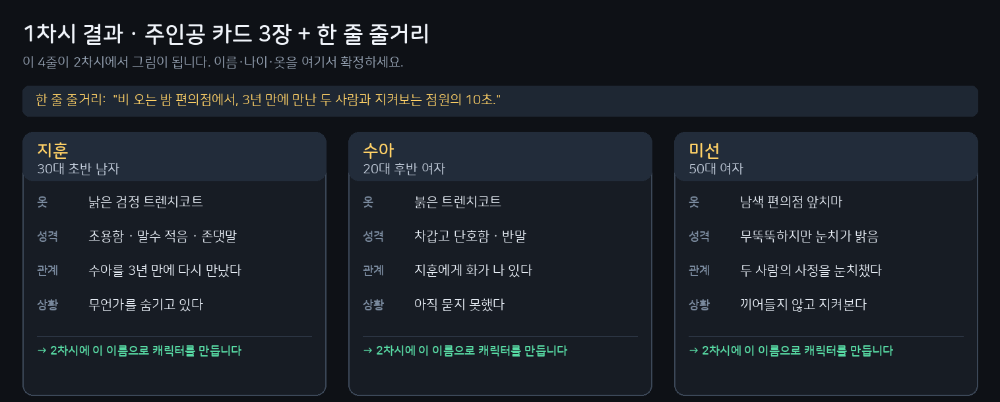

# 1차시 · 이야기 — AI와 함께 주제를 정한다

> **이 스킬은 Flow 사용법이 아니다.**
> AI와 소통해서 **드라마의 주제를 정하고 디테일화하는 것**이 목적이다.
> 그 결과를 **AI가 프롬프트로 써 준다.** Flow 조작은 사람이 알아서 한다.
>
> 🔴 **스킬의 산출물은 프롬프트 텍스트다.** Flow 화면을 조작하지 않는다 (클릭·입력·생성 대행 없음).
> 내어주는 것 3가지: **프롬프트 전문 + 붙일 위치 + 판정 기준.** 붙이고 누르는 것은 사람이 한다.

`💰 0 크레딧` — 이 차시는 Flow를 켜지 않는다. **AI와 대화만 한다.**

**AI가 반드시 읽을 것**: `references/drama-craft.md` (§1 뼈대, §2 개막, §3 압축, §7 대화 규칙) + `references/prompt-anatomy.md` (§2 5부 공식, §6 금지 세트) + `references/character-consistency.md` (§3 4뷰 시트)

---

## ① 이 차시가 끝나면

**기획 카드 1장 + 인물 카드 3장**이 남는다. 그리고 **AI가 써 준 캐릭터 프롬프트 3벌**을 손에 쥔다.



아직 그림은 없다. **이 글 네 줄이 2차시에서 얼굴이 된다.**

---

## ② 이렇게 시작한다

> **"10초짜리 한국어 숏드라마를 만들고 싶어. 네가 작가가 되어서 나한테 물어봐 줘."**

이 한 문장이면 AI가 진행을 맡는다.

---

## ③ AI가 물어볼 것 — **하나씩, 이 순서로**

한 번에 하나만 묻는다. 선택지를 주고 고르게 한다.

| # | 질문 | 무엇이 정해지나 |
|---|---|---|
| 1 | **"누구의 이야기인가요?"** — 평범한 사람 / 직장인 / 학생 / 노인 … | 주인공 |
| 2 | **"보고 나서 어떤 감정이 남았으면 하나요?"** — 속이 시원함(사이다) / 마음 아픔(눈물) / 무서움 / 따뜻함 | 장르·톤 |
| 3 | **"이 사람이 평소라면 절대 하지 않을 행동은 무엇일까요?"** | **개막 3초** |
| 4 | **"이 이야기가 일어나는 곳은 어디인가요?"** — 편의점 / 골목 / 옥탑방 / 지하철 / 국숫집 … | 배경 |
| 5 | **"주인공 말고 두 사람이 더 나옵니다. 누구면 좋겠어요?"** — 관계·나이·역할 | 조연 2명 |

**질문 3번이 이 차시의 핵심이다.** 일상으로 시작하면 10초가 죽는다.

> 답이 나오면 **반드시 되읽어 준다**: "그럼 이렇게 정리했습니다 — … 맞나요?"

---

## ④ AI가 정리해서 보여줄 것 — **기획 카드**

```
────────────────────────────────
제목(가제): 비 오는 밤 편의점
주제      : 3년 만에 만난 두 사람은 서로를 모르는 척한다
감정      : 속이 시원함 (사이다)
장르 톤   : 사실적인 한국 드라마
[0-3초]  젖은 남자가 우산을 접지도 않고 문을 민다
[3-6초]  여자가 "여기서 뭐 하는 거예요?"라고 묻는다
[6-10초] 남자가 대답 대신 고개를 돌리고, 여자가 먼저 나간다
────────────────────────────────
```

**3비트를 먼저 채우고, 그 다음에 인물을 붙인다.** 순서가 반대면 이야기가 안 잡힌다.

---

## ⑤ AI가 써 주는 프롬프트

### P1 · 기획 카드 → **Flow에 넣지 않는다.** 종이에 둔다.

### P2 · 외형 (미리보기) → 2차시에서 확정

지금은 **한 줄 스케치**만 만든다. 2차시에서 `고정항목`·`금지변화`를 붙여 완성한다.

```
30대 초반 한국 남성, 짧게 자른 검은 머리, 지친 눈빛, 옅은 수염 자국,
낡은 검정 트렌치코트, 단색 회색 배경, 사실적인 사진 스타일
```

> 2차시에서 이 스케치를 **4뷰 시트**(정면·3/4·측면·후면 + 얼굴 클로즈업, 한 장)로 확장한다.
> **상반신 정면 1장으로는 옷 디테일이 유지되지 않는다** — 뒷판·소매·신발 정보가 없어 모델이 발명한다.

### P3 · 성격 (미리보기) → 캐릭터 화면의 `캐릭터 정보`에 넣는다

```
지훈: 말수 적고 남을 신경 쓰지 않는 척한다. 감정이 올라와도 목소리를 낮춘다.
```

**P2와 P3을 섞지 않는다.** P2는 그림, P3은 연기다.

---

## ⑥ 막히면

| 증상 | 처방 |
|---|---|
| "무슨 이야기를 할지 모르겠다" | **질문 2번(감정)부터 시작한다.** 주제는 감정에서 나온다 |
| 이야기가 너무 크다 (드라마 한 편 분량) | "이번엔 **한 장면만** 만든다"로 줄인다. 10초는 한 장면이다 |
| 인물이 5명 이상 나온다 | **3명으로 자른다.** 10초에 4명은 안 들어간다 |
| 전부 뻔해 보인다 | 질문 3번(반상식적 행동)으로 돌아간다 |
| AI가 계속 뭉뚱그려 답한다 | "구체적으로, **한 문장으로** 말해 줘" 라고 요청한다 |

---

## ⑦ 확인 카드

다음 차시로 넘어가기 전에 **직접 확인한다.**

- [ ] 주제가 **한 문장**으로 말해지는가
- [ ] 감정이 **하나**로 정해졌는가 (사이다 또는 눈물 — 둘 다 아님)
- [ ] 0-3초에 **사건**이 있는가 (일상이 아님)
- [ ] 인물이 **3명**인가
- [ ] 인물마다 **한 줄 성격**이 있는가
- [ ] AI가 준 **P2 스케치 3벌**을 받았는가

전부 ✅면 다음 차시로.

---

## ⑧ 다음

→ `drama-world` (2차시) — 이 카드가 **Flow 안에서 진짜 얼굴이 된다.**

## 참조 파일

- `references/prompt-recipes.md` — **색인** (어떤 문서를 언제 읽는가)
- `references/drama-craft.md` — **드라마 설계 방법론** (3비트·개막 공식·압축·대화 규칙)
- `references/prompt-anatomy.md` — 5부 구조·타임코드·금지 세트·출력 형식
- `references/character-consistency.md` — 4뷰 시트·편집 파생 (2차시에서 쓴다)
- `references/failure-atlas.md` — 증상 → 원인 → 처방
- `references/flow-paste.md` — 어디에 붙여넣는가 (부록)
- `references/cost-and-safety.md` — 크레딧·승인 창
- `assets/` — 기획 카드 등 양식 7종
