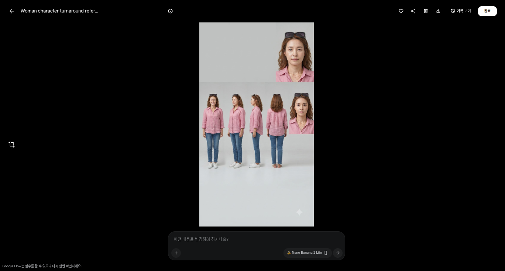
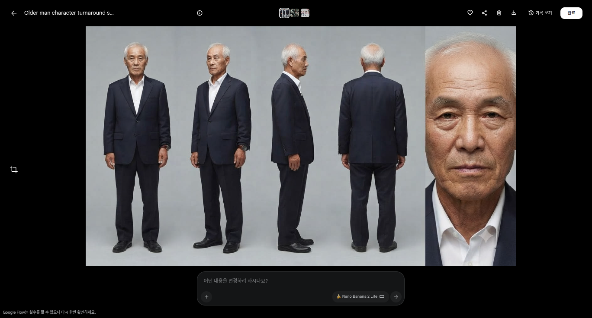

# 2차시 · 세계관과 인물 — 톤을 정하고 **배우의 몸값을 만든다**

> AI와 대화로 **이 드라마의 세계**를 정한다. 그리고 AI가 **바로 쓸 수 있는 캐릭터 시트 프롬프트**를 써 준다.
> Flow는 프롬프트를 붙여넣는 곳일 뿐이다 — 조작은 사람이 한다.
>
> 🔴 **스킬의 산출물은 프롬프트 텍스트다.** Flow 화면을 조작하지 않는다 (클릭·입력·생성 대행 없음).
> 내어주는 것 3가지: **프롬프트 전문 + 붙일 위치 + 판정 기준.** 붙이고 누르는 것은 사람이 한다.

`💰 0 크레딧` — **여기서 만드는 이미지는 전부 무료다.**
실측(2026-09-29): 이미지 모델 `Nano Banana Pro / 2 / 2 Lite` **3종 모두 0크레딧 · 승인 창 없음.**
몇 번을 다시 뽑아도 0원이다. **마음에 들 때까지 다시 만든다.**

**AI가 반드시 읽을 것**: `references/drama-craft.md` (§5 세계관·미장센, §4 고정항목+금지변화) + `references/character-consistency.md` (§2 P2/P3 분리, **§3 4뷰 시트 템플릿**, **§4 편집 파생**, §5 장소 시트) + `references/lighting-and-style.md` (§4 색과 대비)

---

## ① 이 차시가 끝나면

**캐릭터 시트 3장**(배우 3명)과 **장소 시트**(⑤-b)가 생긴다.
시트 1장 = **정면 · 3/4 · 측면 · 후면(전신) + 얼굴 클로즈업**을 한 이미지에 담은 것.



이 배우들은 **앞으로 만들 모든 영상에서 같은 얼굴·같은 옷**으로 나온다.

---

## ② AI와 대화로 세계관 정하기

**Flow를 켜기 전에 AI와 이것부터 정한다.** 정하지 않고 만들면 2편째부터 세계가 달라진다.

AI가 물어볼 것 — **하나씩.**

| # | 질문 | 정해지는 것 |
|---|---|---|
| 1 | **"이 이야기를 낮에 보여줄까요, 밤에 보여줄까요?"** | 조명·색이 한 번에 정해진다 |
| 2 | **"장소를 골라 주세요"** — AI가 한국 정서 후보 3개를 제안 | 배경 |
| 3 | **"화면이 따뜻했으면 하나요, 차가웠으면 하나요?"** | 색온도 |
| 4 | **"카메라가 인물에게 가까이 붙었으면 하나요, 조금 떨어졌으면 하나요?"** | 샷 거리·심도 |

> 질문 2번에서 AI는 `drama-craft.md §5`의 **한국 정서 미장센 목록**에서 후보를 골라 제안한다.
> **대신 정해 주지 않는다. 3개를 보여주고 고르게 한다.**

---

## ③ AI가 써 주는 것 1 — **스타일 전역 1개**

이 한 줄이 **모든 장면 프롬프트에 자동으로 붙는다.** 시리즈를 이어 붙이는 유일한 방법이다.

```
스타일(전역): 사실적인 한국 드라마 톤, 정오의 하얀 직사광, 강한 콘트라스트,
              회색 콘크리트와 스테인리스의 차가운 반사, 탁한 청록 그늘, 얕은 심도
```

**따로 보관한다.** 3차시에서 장면 프롬프트를 쓸 때 이 문장이 재료가 된다.

---

## ④ AI가 써 주는 것 2 — P2 외형 → **뷰 시트**

### 왜 "상반신 정면 1장"이 아니라 "뷰 시트"인가 — 실측 근거

| 관찰 | 원인 | 처방 |
|---|---|---|
| 컷마다 **옷 디테일이 달라진다** | 상반신 정면 1장에는 **뒷판·소매·등·벨트·신발 정보가 없다** → 모델이 그 부분을 **발명**한다 | 같은 옷의 **4뷰를 한 장**으로 만들어 참조로 쓴다 |
| 배경이 컷마다 달라진다 | 배경 참조 자산이 없다 (⑤-b) | 로케이션 시트 1장 |

실측(2026-09-29): 4뷰 시트를 참조로 넣으면 샷이 바뀌어도 **옷·머리·소품(시계·안경)이 유지**됐다.
의상과 소품은 **얼굴보다 더 잘 유지된다** — 그래서 옷 정보를 넣어 주는 것이 가장 값싼 개선이다.

### 시트 1장 구성

```
정면 · 3/4 · 측면 · 후면   (전신, 같은 크기로 나란히)
+ 얼굴 클로즈업 1컷
같은 옷 / 같은 머리 / 단색 밝은 회색 배경 / 화면에 글자 없음
```

템플릿은 `references/character-consistency.md` **§3 (4뷰 시트)** — 그대로 복사해 쓴다.

### 공식 4개 (v1 → v3 수정)

| | v1 | **v3** |
|---|---|---|
| 1 | 단색 배경 | 단색 배경 ✅ 그대로 |
| 2 | **상반신 정면** | **전신 4뷰 (정면·3/4·측면·후면)** |
| 3 | 한 명만 | 한 명만 ✅ 그대로 |
| 4 | 나이·머리·옷 구체적으로 | **+ 무늬·액세서리까지** (`brown patterned blouse`, `thin metal-rimmed glasses`, `leather-strap metal watch`) |

> **얼굴 클로즈업이 시트 안에 들어가므로** "정면 얼굴"의 이점(얼굴 고정)은 그대로 유지된다.

**`금지변화`는 그대로 필수다.** 이 줄이 없으면 2편째부터 다른 사람이 된다.

---

## ⑤ AI가 써 주는 것 3 — **P3 성격** (그림이 아니라 연기)

```
만복: 말수 적고 남을 신경 쓰지 않는 척한다. 감정이 올라와도 목소리를 낮춘다.
      화가 나면 대답 대신 고개를 돌린다.
```

**P3은 그림에 아무 영향이 없다.** 대신 **3차시에서 장면을 만들 때 에이전트가 참고한다.**

**여기가 초보자가 가장 많이 헷갈리는 곳이다.**
설명칸에 "성격이 밝은 사람"을 써도 **표정은 안 바뀐다.** 성격은 P3(정보칸)이다.

---

## ⑤-b · 배경도 자산이다 — **로케이션 시트**

> **현장 교정**: *"캐릭터뿐만 아니라 배경 이미지도 만들어 놔야 잘 유지가 되는 거 같아."*

캐릭터는 `@` 참조 자산이 있어서 얼굴이 유지된다.
**배경은 참조 자산이 없으면 매 생성마다 새로 발명된다.**
같은 국숫집을 두 번 찍었는데 컷마다 다른 시장이 나오는 이유가 이것이다.

**캐릭터와 똑같은 구조로 배경도 고정한다.**

| | 캐릭터 | 배경 |
|---|---|---|
| 자산 | **캐릭터 시트 1장** (4뷰 + 얼굴) | **로케이션 시트 1장** (사람 없는 빈 배경) |
| 고정 문장 | `고정항목` / `금지변화` | `고정항목` / `금지변화` (**같은 형식**) |
| 붙이는 법 | `@캐릭터시트` | `@ 로케이션 시트` |
| 접미어 | — | **장소 접미어 1줄**을 모든 장면 프롬프트에 붙인다 |

**규칙 3개**
1. **사람 없는 빈 배경**으로 만든다 — 인물을 바꿔 끼울 수 있어야 한다
2. **앵글마다 한 장** — 같은 장소라도 카운터 방향 / 도로 방향은 다른 시트다
3. 배경 시트에도 **글자 금지**를 넣는다 (`간판·현수막·가격표 없음`) — 간판 글자는 깨진다

스타일 전역이 **톤**을 고정하고, 장소 접미어가 **공간**을 고정한다. **둘 다 필요하다.**

> ✅ **프레임(키프레임) 슬롯은 실물 화면에 있다** (2026-09-30 실측 정정).
> `⚙ 설정` → **`동영상`** → **`프레임`** 을 누르면 **`시작`** ⇄ **`종료`** 슬롯이 나온다.
> (v1은 "프레임 항목이 없다"고 적었는데, 그건 **이미지 모드** 패널을 본 것이었다 — 동영상 모드에 있다.)
> 실제로 시작 프레임을 붙이는 방법은 3차시 `drama-shots` ⑤.
> **배경 고정은 여전히 `@` 로케이션 시트가 1순위**이고, 시작 프레임은 **첫 컷 구도를 고정**한다.

> 배경·캐릭터 시트는 같은 모델로 만든다 — `⚙ 설정 → 이미지 → 🍌 Nano Banana 2 Lite → 9:16 → x1`.
> **이미지 생성은 0크레딧**(3종 실측)이므로 시트는 몇 장이든 무료다.

---

## ⑤-c · 옷이 두 벌이면 **새로 만들지 않는다 — 편집 파생**

> **현장 교정**: *"만복은 작업복과 정장 두 벌이 필요하다."*

**새로 생성하면 얼굴이 다른 사람이 된다.** 시트에서 **편집 프롬프트**로 환복시킨다.



| | 방법 |
|---|---|
| ✅ **파생** | 시트를 연 편집기 → **`어떤 내용을 변경하시나요?`** → `옷만 바꿔줘 … 나머지는 그대로 유지` |
| ❌ 새로 생성 | 얼굴·주름·체형이 달라진다 (실측) |

**규칙** (`references/character-consistency.md` §4 편집 파생)
1. **한 번에 변수 하나** — 옷만
2. **`나머지는 그대로 유지해`** 를 반드시 붙인다 (얼굴·머리·자세·4뷰 배치·배경·조명)
3. **4턴을 넘기지 않는다**

실측(2026-09-29): 만복 작업복 시트 → 편집 파생으로 **같은 얼굴 그대로** 남색 정장. 시계도 유지됐다.

---

## ⑥ Flow에서 **사람이** 할 일 — 붙여넣기만 (**0크레딧**)

> 스킬의 몫은 프롬프트를 여기까지 만들어 주는 것이다. **아래 클릭은 사람이 직접 한다.**

```
⚙ 설정 → 이미지 → 🍌 Nano Banana 2 Lite → 9:16 → x1
   ↓ 시트 프롬프트 붙여넣기 → 생성 시작          [0크레딧 · 승인 창 없음]
   ↓ ★ 이름 붙이기 : `미영 시트` / `만복 시트` / `순자 시트`
   ↓ 캐릭터 수만큼 반복 (2벌은 편집 파생)
   ↓ 장소 시트도 같은 방식으로 (⑤-b)
```

**① 이름을 꼭 붙인다 — 실측 근거 (2026-09-30)**

소재 피커에서 **썸네일이 깨져 보일 때가 있고**, 제목은 잘려서 나온다.
미영 시트와 순자 시트가 **똑같이 `Woman character turnaround refer…`** 로 보여서 **눈으로 구분할 수 없다.**

→ **역할이 드러나는 이름**을 붙여 두면 **피커에서 제목으로 정확히 찾을 수 있다.**
→ 이름을 안 붙이면 3차시 `@` 목록에서 못 찾는다.

**② 설명칸과 정보칸을 바꿔 넣지 않는다**

| 단계 | 어디에 |
|---|---|
| **P2 외형(시트)** | 시트 프롬프트를 **프로젝트 화면 프롬프트 상자**에 넣는다 (이미지 모드) |
| **P3 성격** | 캐릭터를 등록했다면 캐릭터 상세 → **`캐릭터 정보`** |

> **왼쪽(설명)은 그림, 정보칸은 연기다.** 이 둘을 바꿔 넣는 것이 가장 흔한 실수다.
> 자세한 위치는 `references/flow-paste.md`.

---

## ⑦ 막히면

| 증상 | 처방 |
|---|---|
| **옷 디테일이 컷마다 달라진다** | 시트에 **뒷모습·소매·신발**이 들어갔는지 확인. 빠졌으면 **시트를 다시 뽑는다(0크레딧)** |
| 옷 **무늬**가 흔들린다 | 무늬를 글로 명시(`brown patterned blouse`) + 필요하면 **의상 클로즈업 1장** 추가 |
| 2벌인데 **얼굴이 바뀌었다** | 새로 만들었다 → **편집 파생**으로 다시 (⑤-c) |
| 캐릭터가 `@` 목록에서 안 보인다 | **이름을 안 붙였다** |
| 썸네일이 깨져 보인다 | **정상이다**(표시 문제). **제목으로 구분**하고, 미리 이름을 붙여 둔다 |
| 배경이 단색이 아니다 | 시트 프롬프트 **맨 앞쪽**에 `Plain flat light grey seamless studio background` |
| 3명이 비슷하게 생겼다 | **나이대·옷 색·소품(안경/시계/앞치마 색)** 을 확실히 벌린다 |
| 성격을 넣었는데 표정이 그대로 | **정상이다.** P3은 그림에 영향이 없다 |
| 얼굴만 마음에 안 든다 | **편집 파생으로 한 가지만** 고친다: `얼굴만 … 나머지는 그대로 유지` |

**💰 여기서는 몇 번을 다시 해도 0원이다.** 마음에 들 때까지 다시 만들어도 된다.

---

## ⑧ 확인 카드

- [ ] 세계관 **스타일 1줄**이 정해졌는가
- [ ] 캐릭터 **3명**의 **뷰 시트**(정면·3/4·측면·후면+얼굴)가 있는가
- [ ] 시트에 **같은 옷·같은 머리·소품(안경·시계)** 이 명시됐는가
- [ ] **이름이 붙어 있는가** (`미영 시트` 처럼 역할이 드러나게)
- [ ] 옷이 2벌인 캐릭터는 **편집 파생**으로 만들었는가 (새로 만들지 않았는가)
- [ ] **로케이션 시트**(사람 없는 빈 배경)를 만들어 `@` 로 붙였는가
- [ ] **화면에 글자 금지**가 들어갔는가 (`간판·현수막·가격표 없음`)
- [ ] P3(성격)을 **`캐릭터 정보`** 칸에 넣었는가 (설명칸이 아님)

---

## ⑨ 다음

→ `drama-shots` (3차시) — **콘티로 승인받고, 키프레임으로 연기시킨다.**

## 참조 파일

- `references/prompt-recipes.md` — **색인**
- `references/character-consistency.md` — **4뷰 시트 템플릿 · 편집 파생 · 장소 시트 · 참조 붙이기**
- `references/lighting-and-style.md` — 스타일 전역 문장·시간대 빛·색과 대비
- `references/prompt-anatomy.md` — 5부 구조·금지 세트
- `references/drama-craft.md` — 세계관·미장센 자산, 고정항목+금지변화
- `references/failure-atlas.md` — 옷·얼굴이 흔들릴 때의 처방
- `references/flow-paste.md` — 붙여넣기 위치·이름 붙이기·소재 붙이기 (부록)
- `references/cost-and-safety.md` — 이미지가 0크레딧인 이유, 승인 창
- `assets/` — 캐릭터 시트·장소 시트 양식
- `references/figures/` — 뷰 시트·편집 파생 화면
